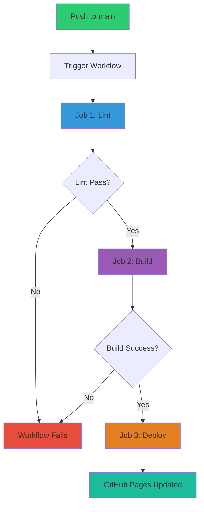

# GitHub Actions Setup Guide

## Overview

This project includes a fully automated CI/CD pipeline using GitHub Actions that automatically lints Python code, builds the Hugo documentation site, and deploys it to GitHub Pages on every push to the `main` branch.

## Workflow Architecture



## Workflow File

The workflow is defined in `.github/workflows/deploy.yml`:

```yaml
name: Build & Deploy Documentation

on:
  push:
    branches:
      - main
  workflow_dispatch:  # Allow manual trigger
```

## Three Pipeline Jobs

### Job 1: Lint Python Code

**Purpose**: Ensure code quality before deployment

**What it does**:
- Checks out the repository
- Sets up Python 3.11
- Installs `flake8` linter
- Runs two-pass linting:
  1. **Strict pass**: Fails on syntax errors and undefined names
  2. **Warning pass**: Reports style issues without failing

**Configuration**:
```yaml
lint:
  name: Lint Python Code
  runs-on: ubuntu-latest

  steps:
    - name: Run flake8 on python-app
      working-directory: python-app
      run: |
        # Critical errors only (fail build)
        flake8 . --count --select=E9,F63,F7,F82 --show-source --statistics

        # Style warnings (don't fail build)
        flake8 . --count --exit-zero --max-complexity=10 --max-line-length=100 --statistics
```

**Error Codes Checked**:
- `E9`: Runtime errors (syntax, indentation)
- `F63`: Invalid print statement usage
- `F7`: Syntax errors in statements
- `F82`: Undefined names in `__all__`

### Job 2: Build Hugo Documentation

**Purpose**: Generate static documentation site

**What it does**:
- Checks out repository with submodules (Hugo theme)
- Installs Hugo 0.141.0 Extended
- Builds the documentation site with minification
- Uploads built site as artifact for deployment

**Key features**:
```yaml
build:
  name: Build Hugo Documentation
  runs-on: ubuntu-latest
  needs: lint  # Only runs if lint job passes

  steps:
    - name: Checkout code
      uses: actions/checkout@v4
      with:
        submodules: recursive  # Critical for Hugo themes
        fetch-depth: 0         # For .GitInfo and .Lastmod

    - name: Setup Hugo
      uses: peaceiris/actions-hugo@v3
      with:
        hugo-version: '0.141.0'
        extended: true  # Required for Relearn theme

    - name: Build Hugo site
      working-directory: docs
      run: hugo --minify  # Optimize output
```

**Why `submodules: recursive`?**
- The Relearn theme is installed as a Git submodule
- Without this, the build would fail with "theme not found"

**Why `fetch-depth: 0`?**
- Allows Hugo to access Git history
- Enables `.GitInfo` (commit info) and `.Lastmod` (last modified dates)

### Job 3: Deploy to GitHub Pages

**Purpose**: Publish documentation to GitHub Pages

**What it does**:
- Waits for build job to complete successfully
- Deploys artifact to GitHub Pages
- Returns deployment URL

**Configuration**:
```yaml
deploy:
  name: Deploy to GitHub Pages
  runs-on: ubuntu-latest
  needs: build  # Only runs if build succeeds

  environment:
    name: github-pages
    url: ${{ steps.deployment.outputs.page_url }}

  steps:
    - name: Deploy to GitHub Pages
      id: deployment
      uses: actions/deploy-pages@v4
```

## Enabling GitHub Pages

{}
Before the workflow can deploy, you **must** enable GitHub Pages in your repository settings.
{}

### Step-by-Step Setup

**1. Push the workflow to GitHub**:
```bash
git add .github/workflows/deploy.yml
git commit -m "Add GitHub Actions deployment workflow"
git push origin main
```

**2. Enable GitHub Pages**:
1. Go to your repository on GitHub
2. Click **Settings** → **Pages** (in left sidebar)
3. Under "Build and deployment":
   - **Source**: Select "GitHub Actions"
   - (NOT "Deploy from a branch")
4. Click **Save**

**3. Configure Pages Permissions** (if needed):
1. Go to **Settings** → **Actions** → **General**
2. Scroll to "Workflow permissions"
3. Select **Read and write permissions**
4. Check **Allow GitHub Actions to create and approve pull requests**
5. Click **Save**

**4. Trigger the workflow**:
- **Automatic**: Push any commit to `main` branch
- **Manual**: Go to **Actions** tab → Select "Build & Deploy Documentation" → Click "Run workflow"

**5. Verify deployment**:
- Go to **Actions** tab
- Click on the latest workflow run
- Check that all three jobs (lint, build, deploy) completed successfully
- Visit your GitHub Pages URL (shown in deploy job output)

### Your Documentation URL

After successful deployment, your documentation will be available at:

```
https://<username>.github.io/<repository>/
```

**Example**:
- Repository: `github.com/karmen87/Crypto_Alarm`
- Documentation URL: `https://karmen87.github.io/Crypto_Alarm/`

## Workflow Permissions

The workflow requires specific permissions defined in the YAML file:

```yaml
permissions:
  contents: read      # Read repository contents
  pages: write        # Deploy to GitHub Pages
  id-token: write     # OIDC token for deployment
```

These permissions allow the workflow to:
- ✅ Read source code and documentation files
- ✅ Build the Hugo site
- ✅ Deploy to GitHub Pages environment

## Concurrency Control

```yaml
concurrency:
  group: "pages"
  cancel-in-progress: false
```

**What this does**:
- Only one deployment can run at a time
- If a new deployment starts while one is running, it waits (doesn't cancel)
- Prevents race conditions and partial deployments

## Manual Triggering

The workflow includes `workflow_dispatch` trigger:

```yaml
on:
  push:
    branches:
      - main
  workflow_dispatch:  # Enables manual trigger
```

**To manually trigger**:
1. Go to **Actions** tab on GitHub
2. Select "Build & Deploy Documentation"
3. Click "Run workflow" button
4. Select branch (usually `main`)
5. Click "Run workflow"

**Use cases**:
- Rebuild documentation after GitHub Pages settings change
- Force rebuild without pushing new commits
- Test workflow after modifications

## Monitoring Workflow Runs

### Viewing Logs

1. Go to **Actions** tab
2. Click on a workflow run
3. Click on individual jobs (lint, build, deploy)
4. Expand steps to see detailed logs

### Common Log Sections

**Lint job**:
```
Run flake8 on python-app
./app.py:45:80: E501 line too long (101 > 100 characters)
./app.py:67:1: F401 'json' imported but unused
2     E501 line too long
1     F401 'json' imported but unused
```

**Build job**:
```
Building sites …
hugo v0.141.0

                   | EN
-------------------+-----
  Pages            | 21
  Paginator pages  |  0
  Non-page files   |  0
  Static files     |  0
  Processed images |  0
  Aliases          |  0
  Cleaned          |  0

Total in 542 ms
```

**Deploy job**:
```
Deploying to GitHub Pages...
Deploy successful!
Published to: https://karmen87.github.io/Crypto_Alarm/
```

## Troubleshooting

### Workflow Fails on Lint Job

{}
**Error**: `E9,F63,F7,F82` errors cause build failure

**Solution**:
```bash
# Install flake8 locally
pip install flake8

# Run the same check as CI
cd python-app
flake8 . --count --select=E9,F63,F7,F82 --show-source --statistics

# Fix reported errors and commit
git add .
git commit -m "Fix linting errors"
git push
```
{}

### Workflow Fails on Build Job

**Error**: `theme not found`

**Solution**: Ensure Git submodule is initialized
```bash
git submodule update --init --recursive
git add .gitmodules docs/themes/
git commit -m "Initialize Hugo theme submodule"
git push
```

---

**Error**: `hugo: command not found`

**Solution**: This shouldn't happen with `actions-hugo@v3`, but if it does:
- Check Hugo version in workflow matches available version
- Verify `extended: true` is set (required for Relearn theme)

### Workflow Fails on Deploy Job

**Error**: `Resource not accessible by integration`

**Solution**: Check permissions in repository settings
1. **Settings** → **Actions** → **General**
2. Enable "Read and write permissions"
3. Re-run workflow

---

**Error**: `Page build failed`

**Solution**: Ensure GitHub Pages source is set to "GitHub Actions"
1. **Settings** → **Pages**
2. Source: **GitHub Actions** (not "Deploy from a branch")

## Workflow Performance

### Typical Run Times

| Job | Average Duration | Cache Impact |
|-----|------------------|--------------|
| Lint | 30-45 seconds | 15s with cache |
| Build | 1-2 minutes | 30s with cache |
| Deploy | 30-60 seconds | N/A |
| **Total** | **2-4 minutes** | **~1.5 minutes** |

### Optimization Tips

**1. Enable caching** (already configured):
```yaml
- uses: actions/setup-python@v5
  with:
    python-version: '3.11'
    cache: 'pip'  # Caches pip dependencies
```

**2. Conditional execution**:
```yaml
# Only build docs if docs/ folder changed
on:
  push:
    branches:
      - main
    paths:
      - 'docs/**'
      - '.github/workflows/deploy.yml'
```

**3. Parallel jobs** (if adding more checks):
```yaml
jobs:
  lint-python:
    # Runs in parallel
  lint-javascript:
    # Runs in parallel
  test:
    # Runs in parallel
```

## Cost & Usage

**GitHub Actions Minutes**:
- **Public repositories**: Unlimited free minutes
- **Private repositories**: 2,000 free minutes/month

**This workflow uses**:
- ~3 minutes per run
- If you push 100 times/month: ~300 minutes
- Well within free tier limits

## Adding Status Badge

Show workflow status in your README:

```markdown

```

**Result**:


## Security Considerations

### Secrets Management

This workflow doesn't use custom secrets (uses built-in `GITHUB_TOKEN`).

If you need to add secrets:
1. **Settings** → **Secrets and variables** → **Actions**
2. Click "New repository secret"
3. Add secret name and value
4. Reference in workflow: `${{ secrets.SECRET_NAME }}`

### Dependency Security

**Dependabot configuration** (optional):

Create `.github/dependabot.yml`:
```yaml
version: 2
updates:
  - package-ecosystem: "github-actions"
    directory: "/"
    schedule:
      interval: "weekly"
```

This keeps GitHub Actions dependencies up-to-date.

## Custom Domain (Optional)

To use a custom domain for documentation:

**1. Add CNAME file**:
```bash
echo "docs.your-domain.com" > docs/static/CNAME
git add docs/static/CNAME
git commit -m "Add custom domain"
git push
```

**2. Configure DNS**:
- Add CNAME record: `docs.your-domain.com` → `<username>.github.io`

**3. Enable in GitHub**:
- **Settings** → **Pages**
- Enter custom domain
- Check "Enforce HTTPS"

## Next Steps

- Review **CI/CD Pipeline** documentation for more advanced workflows
- Explore **DevOps** section for testing and deployment strategies
- Check **Implementations** for application-specific details

---

**Your documentation is now automatically deployed on every push to `main`!** 🚀
