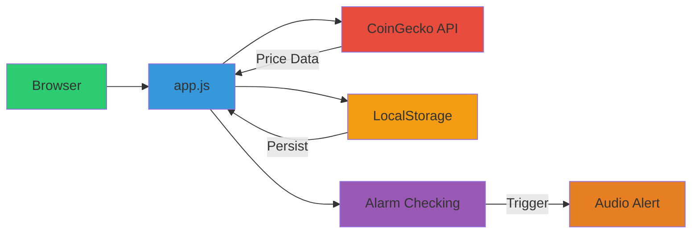
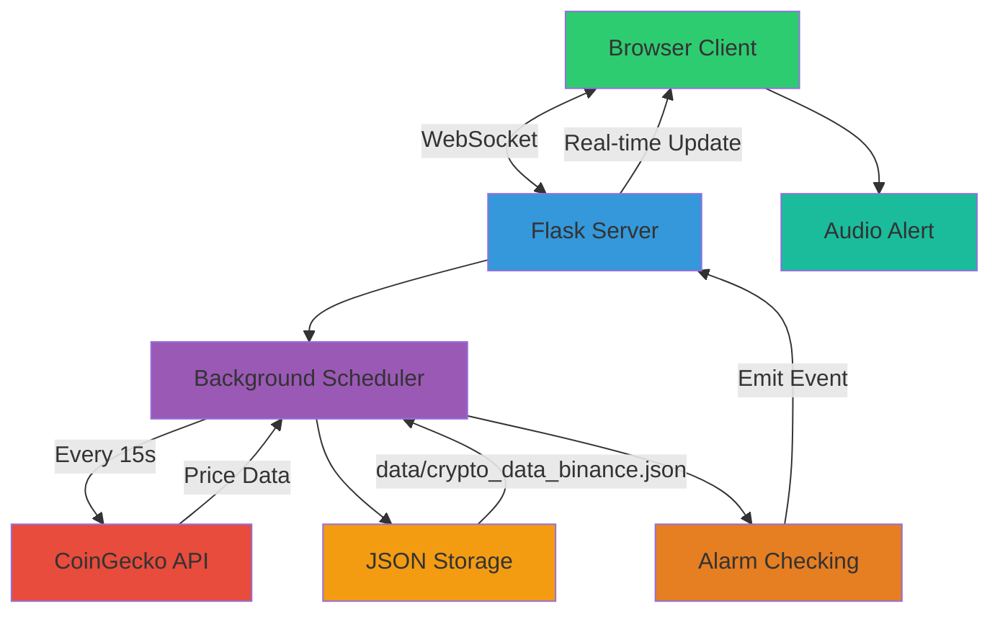

# Implementations

## Choose Your Flavor

Crypto Price Alarm offers two distinct implementations, each designed for different use cases and technical requirements. Both provide the same core functionality but differ in architecture, deployment, and advanced capabilities.

## JavaScript vs Python: Decision Matrix

| Aspect | JavaScript App | Python App |
|--------|----------------|------------|
| **Deployment** | Open HTML file in browser | Requires Flask server |
| **Installation** | None | Python + dependencies |
| **Data Storage** | Browser LocalStorage | JSON file on server |
| **Real-Time Updates** | JavaScript polling (15s) | WebSocket support |
| **Best For** | Personal use, simplicity | Teams, server deployment |
| **Monitoring** | Client-side only | Server-side + logging |
| **Portability** | 100% portable | Requires environment setup |

## Architecture Overview

### Path A: JavaScript App (Client-Side Simplicity)



**Data Flow**:
1. Browser loads `index.html` with inline JavaScript
2. `app.js` polls CoinGecko API every 15 seconds
3. Price data stored in browser's LocalStorage
4. Alarm conditions checked client-side
5. Audio alert plays when conditions met

**Philosophy**: Zero-friction deployment. No build tools, no servers, no dependencies.

---

### Path B: Python App (Server-Side Power)



**Data Flow**:
1. Browser connects to Flask server via WebSocket
2. Server's background scheduler fetches prices every 15 seconds
3. Price data persisted to JSON file on server
4. Server-side alarm checking runs continuously
5. WebSocket pushes updates to all connected clients in real-time
6. Client-side JavaScript plays audio alert

**Philosophy**: Centralized monitoring with multi-client support and server-side reliability.

## When to Choose Each

### Choose JavaScript if you:
- Want instant setup with no installation
- Need portability (run from USB, cloud storage, etc.)
- Prefer client-side data control
- Are monitoring for personal use only
- Don't want to manage a server

### Choose Python if you:
- Need server-side monitoring (runs even when browser closed)
- Want WebSocket real-time updates
- Require centralized data for multiple users
- Need logging and audit trails
- Have infrastructure for Python deployment

## Technical Deep Dive: Side-by-Side Comparison


{}

### LocalStorage (JavaScript) vs JSON File (Python)

**JavaScript App - LocalStorage**:
```javascript
// Store entire state in browser
localStorage.setItem('cryptoPairs', JSON.stringify({
  "BTCUSDT": {
    "currentPrice": 50000,
    "maxPrice": 52000,
    "minPrice": 48000,
    "alarms": [...]
  }
}));

// Retrieve on page load
const data = JSON.parse(localStorage.getItem('cryptoPairs'));
```

**Benefits**:
- ✅ Zero setup required
- ✅ Data never leaves your browser (privacy)
- ✅ Works offline (after initial load)
- ✅ Instant persistence (no network latency)

**Limitations**:
- ❌ Browser-specific (doesn't sync across devices)
- ❌ Can be cleared by browser cache cleaning
- ❌ Limited to ~5-10MB storage quota
- ❌ Single-user only

---

**Python App - JSON File Storage**:
```python
# Server-side JSON file
with open('data/crypto_data_binance.json', 'w') as f:
    json.dump({
        "pairs": {
            "BTCUSDT": {
                "currentPrice": 50000,
                "maxPrice": 52000,
                "minPrice": 48000,
                "alarms": [...]
            }
        }
    }, f, indent=2)
```

**Benefits**:
- ✅ Centralized storage for multiple clients
- ✅ Survives browser restarts/crashes
- ✅ Can be backed up, version-controlled
- ✅ No storage quota limits

**Limitations**:
- ❌ Requires server infrastructure
- ❌ File I/O overhead (mitigated by caching)
- ❌ Potential concurrency issues (handled with locking)

{}

{}

### Client-Side Polling vs WebSocket Real-Time

**JavaScript App - Client-Side Polling**:
```javascript
// Browser polls every 15 seconds
setInterval(async () => {
  for (const pair of activePairs) {
    const price = await fetchFromCoinGecko(pair);
    updateUI(pair, price);
    checkAlarms(pair, price);
  }
}, 15000);
```

**Characteristics**:
- 🔄 Browser initiates all updates
- 📡 Direct API calls from browser to CoinGecko
- 🔋 Tab must stay open for monitoring
- ⏱️ Fixed 15-second update interval

**Pros**: Simple, no server required
**Cons**: Browser tab must remain active

---

**Python App - WebSocket Real-Time**:
```python
# Server pushes updates to all clients
@sched.scheduled_job('interval', seconds=15)
def update_prices():
    for pair in pairs:
        price = fetch_from_coingecko(pair)

        # Broadcast to ALL connected clients
        socketio.emit('price_update', {
            'pair': pair,
            'price': price
        })
```

**Client receives updates**:
```javascript
// Browser listens for server events
socket.on('price_update', (data) => {
  updateUI(data.pair, data.price);
  checkAlarms(data.pair, data.price);
});
```

**Characteristics**:
- 🚀 Server initiates updates (push, not pull)
- 📡 Single server fetches data for all clients
- 🔋 Monitoring continues even if browser closed
- ⚡ Instant updates to all connected clients

**Pros**: True real-time, server-side reliability
**Cons**: Requires server infrastructure

{}


## Migration Path

Both apps use compatible data structures. Migrating between implementations requires minimal effort:

1. Export alarm configurations from one app
2. Transform storage format (LocalStorage ↔ JSON)
3. Import into the other app

Detailed migration scripts are available in the DevOps section.

## Next Steps

Explore the detailed documentation for each implementation:

- **JavaScript App** - LocalStorage, client-side architecture
- **Python App** - Flask, WebSocket, JSON storage
